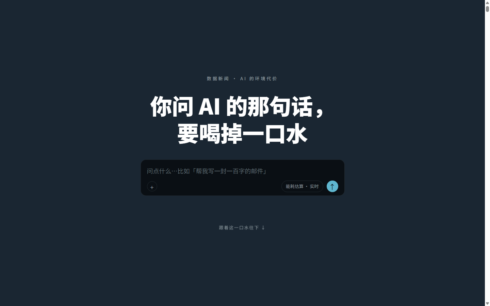

# 你问 AI 的那句话，要喝掉一口水
### The Body of the Cloud — a scrollytelling data story on AI's environmental cost

跟着一滴水走完它在 AI 数据中心里的一生：被抽走、扛热、蒸发，再看电表怎么转、账单寄给谁、碳排落在哪。8 段滚动长卷，全部图形手写渲染。

Follow a single drop of water through an AI data center — withdrawal, cooling, evaporation — then trace the electricity, the bills, and the emissions it leaves behind. An 8-chapter scrollytelling long-form, with every visual hand-rendered.

**▶ Live: https://sunnywang666.github.io/AI-to-environment-new/**

| 桌面端 Desktop | 移动端 Mobile |
|---|---|
|  |  |

## 技术栈 / Tech Stack

- **渲染 Rendering**：Canvas 2D 手绘图表（柱状、贝塞尔发光曲线、双路水流）+ Three.js 手写 3D 场景（芯片、结尾）——正文不依赖任何图表库 / hand-drawn Canvas 2D charts and custom Three.js 3D scenes; no charting library in the story
- **滚动 Scroll**：GSAP ScrollTrigger pin + 进度驱动 requestAnimationFrame 的自研 `scene()` 引擎 / a custom `scene()` engine feeding scroll progress into rAF loops
- **性能 Performance**：视口外不渲染、移动端粒子密度与 pixelRatio 自适应 / off-viewport rendering paused, mobile-adaptive particle density

## 亮点 / Highlights

- 自研滚动叙事引擎：统一的"按段均分进度 → 滑入定格 → 划走"时序模型 / a unified progress-slicing timing model powering all 8 chapters
- 同一事实的两种算法并列呈现（0.26 毫升 vs 519 毫升），把统计口径差异本身写成叙事 / competing estimates (0.26 ml vs 519 ml per query) presented side by side, turning methodology gaps into the story
- 四色语义高亮系统贯穿全文：水 / 电 / 排放 / 生态 / a four-color semantic highlight system (water, energy, emissions, ecology)

## 数据来源 / Data Sources

正文数字均在页面尾注标明出处：IEA《Energy and AI》(2025)、UNU-INWEH (2026)、UC Riverside/CACM (2025)、LBNL (2024)、《The Unpaid Toll》(2024)、PBS/AP (2026)、Ember/OWID、EIA、SELC (2025)、Grid Strategies (2024)、IPCC AR6。不同来源间的口径差异在正文中已明示。

All figures are cited in the endnote of the story; discrepancies between sources are addressed explicitly in the text.

## 结构 / Structure

```
story.html      正文（唯一入口，index.html 自动跳转）
js/story.js     渲染引擎与全部场景
css/ data/      样式与地理底图
drafts/         开发过程中的单图原型（非成品）
poster/         同题 80x200cm 海报的生产文件
```

深圳大学传播学院《数据新闻与可视化》课程大作业 · 2026
